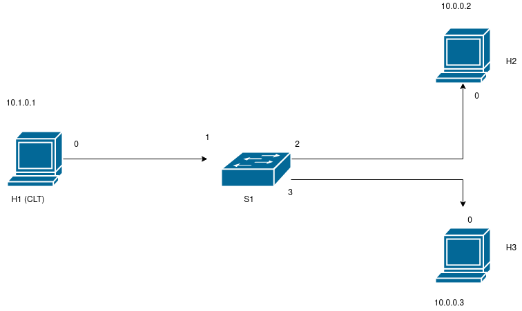

# P4 Flow Classifier

----

## Licence
- :office: This work is part of the [MOSAICO PROJECT](https://www.mosaico-project.org/)
- :fr: Copyright (c) 2022 [Centre National de la Recherche Scientifique](https://cnrs.fr). All Rights Reserved.
- :black_nib: Author: GRAFF Philippe
- :link: The DT classifier has been trained thanks to `pcap` traces available on this website [link](https://cloud-gaming-traces.lhs.loria.fr/).
- :open_file_folder: The `Utils` folder is used by our program
  - :point_right: `Approx`: division approximation
  - :point_right: `LoadRulesDT`: export trained DT in CSV
  - :point_right: `Visualize`: visualize features & classification results

----

## Software Used / Installation
- :warning: Needed libraries:
  - You need **Docker** to make it work
  - Python libraries: **scikit-learn** - **graphviz** - **joblib**
- :open_file_folder: The `includes` folder contains third party Software
  - Some come from the [P4 repository](https://github.com/p4lang/)
  - `tcpreplay-x.y.z` comes from ([tcpreplay :link:](https://github.com/appneta/tcpreplay/releases))

----

## Objective
- P4 program **recognizing** CG traffic
- 33ms windows
- Features computation when window is over
- Features stored inside the packet closing the window (<em>metadata</em>)
- If predicts CG :point_right: bit CG to `1`
- In `visualize`, we read the P4 logfile
  - Displays the features (**12**) on graphs
  - Prompts the CG percentage (*ratio Reports CG/Reports*)

----

## P4 Controller

### * Generates the topology
- <em> mininet </em>
- `1` switch
- `3` hosts

- Rules to forward the trafic

### * Install lookup tables (division)
- Approximates a division
- With 3 reverse powers of 2
- 1/Y ~ 1/2**a** + 1/2**b** + 1/2**c**
- X/Y ~ X>>**a** + X>>**b** + X>>**c**
- For Y in [1;4095] (`2**12-1`)
- Will be used for **mean** and **std** calculation
- :bangbang: We always have 3 reverse power of 2 (:point_right: +1/2**255** if not necessary)
- :bangbang: The same table is present twice (impossible to look twice)

### * Install Feature Rules
- Loads CSV file `FTR_Ruls.csv`
- In <em> LoadRulesDT </em>
- More details: :point_right: in this folder
- Represents a feature with an **Index**
- Function of the thresholds of that feature in the DT
| Feati | 0 | 37 | 42 | 58 | 63 |
|-|-|-|-|-|-|
- If Feati = 41
  - 37<41<42
  - Then **index** = 2

### * Install Action Rules
- Loads CSV file `ACT_Ruls.csv`
- In <em> LoadRulesDT </em>
- More details: :point_right: in this folder
- One rule per leaf
- Given the feature's **indexes** (Cf II.c)), find the adequate leaf
- Give the label associated with that leaf

----

## P4 Program

### * Instructions
- Limitation to UDP traffic (`hdr.udp.isValid` : ¬UDP => ¬CG )
- Get to know the traffic direction (function of the IPv4 prefix)
- Compute the Hash: an index **ind** of the conversation in the registers
- If end of window or collision:
  - Retrieve Data UP & Down
  - Do the divisions
  - Classify
  - Initialize
- If window is not over:
  - Update values

### * Registers
Associate a conversation (IP1 <-> IP2) to its data.
- **16** registers
  - 2 *global* registers
  - 7 registers *downlink*
  - 7 registers *uplink*
-   **Global** Registers (2):
  - Links **ind** to the conversation key (IP1+IP2)
  - Start of current temporal window
- **Directional** registers (7x2):
  - Number of elements (*in current window*)
  - Sum of packet sizes
  - Last mean of packet sizes
  - Sum of squared deviance (size-LastMean)2
  - Last timestamp (:point_right: compute IAT)
  - Last mean of IATs
  - Sum of squared deviance (iat-LastMean)2

### * Metadata
- 3 values linked to **global** registers
  - Index **ind**
  - Collision (*2 conversations have same ind*)
  - End of window
- 7 values read in the **directional** registers (UP or DOWN)
- 12 features computed (*end of the window*)
- 12 indexes of the features (*end of the window*)
- Is CG (*end of the window*)

----

## How it works
1. Go to the folder `/Utils/Approx`
  - Call `make`
  - Execute `a.out` and type 4095
  - It will generate `out.csv`.
  - `out.csv` is used by the main program.
  - :thumbsup: There is a **Readme** if necessary
2. Go to the folder `/Utils/LoadRulesDT`
  - Type `python3 dum2cond.py`
  - It will generate `ACT_Ruls.csv` and `FTR_Ruls.csv`
  - `ACT_Ruls.csv` and `FTR_Ruls.csv` are used by the main program.
  - :thumbsup: There is a **Readme** if necessary
3. Go to the folder `P4-Classifier/`
  - Call `sudo make`
  - :warning: You need **root privileges**
  - It compiles everything
4. Instantiate a **host**
  - Open a new terminal in `P4-classifier/`
  - Call `sudo make h1`
  - Type `./Host.sh INTERF PATH_TO_PCAP` from a host
  - :bulb: need to store a *pcap* file in `Data/`
  - Type `x.y.z` when asked tcpreplay version (**Software Used / Installation**)
  - It will generate trafic
5. Go to the folder `Utils/Visualize`
  - Execute `FtsFromLog.sh`
  - You will be asked a conversation number
  - Look at `out.csv` :point_right: last column = identifier
  - Type the most frequent identifier
  - You will be prompted % of CG recognition
  - There will be some graph in `Utils/Visualize/Out/`

----

Made with :heart: by GRAFF Philippe
